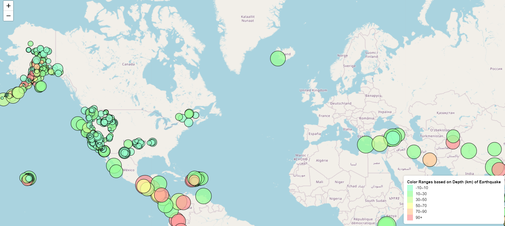

# USGS Earthquake Data Visualization - Leaflet Challenge 

## Overview

This project aims to visualize earthquake data collected by the United States Geological Survey (USGS) using a web-based interactive map. The map will display earthquake locations worldwide and provide additional information about each event when clicked. The visualization will help educate the public and government organizations about seismic activity and its impact on our planet.

## Background

The United States Geological Survey (USGS) is a scientific agency responsible for gathering data on natural hazards, ecosystem health, climate change, and land-use effects. To improve public awareness and secure funding, the USGS wants to develop a set of tools for visualizing earthquake data effectively.

## Programs Utilized

* HTML 
* CSS
* JavaScript
* Leaflet

## Instructions

#### Get the Dataset

To visualize the earthquake data, we will use the USGS GeoJSON Feed. The dataset is available in JSON format, which is updated every 5 minutes. To access the data, follow these steps:

1. Visit the [USGS GeoJSON Feed](http://earthquake.usgs.gov/earthquakes/feed/v1.0/geojson.php) page.
2. The dataset we choose to visualize was "All Earthquakes from the Past 7 Days"
3. Obtain the JSON representation of the selected dataset: [Past 7 Day Earthquale](https://earthquake.usgs.gov/earthquakes/feed/v1.0/summary/all_week.geojson)

#### Importing and Visualizing Data
Using the Leaflet library, we developed a dynamic map that displays earthquake locations and relevant information. Data markers on the map are positioned according to the longitude and latitude of each earthquake. The size of the markers corresponds to the earthquake's magnitude, while the color represents the depth of the seismic event. Deeper earthquakes are depicted with darker colors.

#### Enhancing User Experience
To provide users with more information, we added popups to each marker. When a user clicks on a marker, a popup displays additional details about the associated earthquake. This enhances the interactivity and engagement of the visualization.

#### Creating a Legend
For better understanding of the map, we implemented a legend that explains the relationships of the earthquakes in different colors, which indicates the depth of the earthquakes. This legend provides context to interpret the visualization effectively.

The end result of our efforts is a comprehensive earthquake visualization that enables users to explore recent seismic events in an intuitive and informative manner. The map presents a clear picture of earthquake distribution, magnitude, and depth, enhancing our understanding of these geological phenomena.

* JavaScript Code found here: [logic.js](Code/static/js/logic.js)

# How to run the code:

* Clone the GitHub Repo onto your local 
* Open the [index.html](Code/index.html) onto a browser to access the interactive map. 